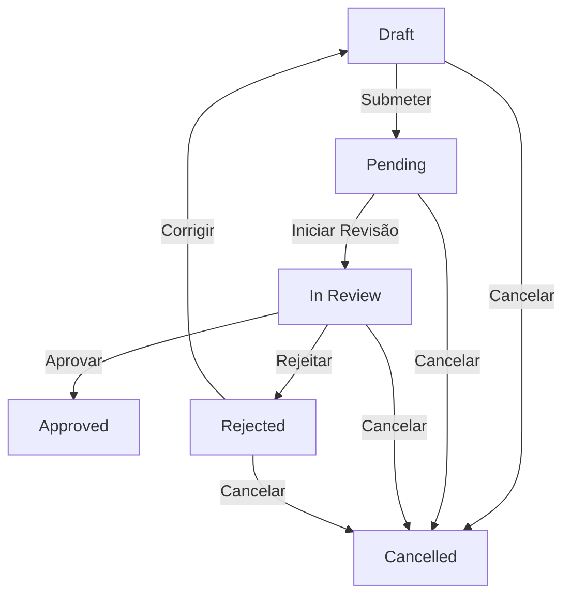

# MVP - Sistema de Requests e Aprovação

## Índice
1. [Visão Geral](#1-visão-geral)
2. [Contexto do Negócio](#2-contexto-do-negócio)
3. [Contexto do Sistema Click Cannabis (Oslo, Click, Áreas)](#3-contexto-do-sistema-click-cannabis)
4. [Escopo do MVP](#4-escopo-do-mvp)
5. [Content Types - Guia Completo](#5-content-types---guia-completo)
6. [Modelo de Dados](#6-modelo-de-dados)
7. [Regras de Negócio](#7-regras-de-negócio)
8. [Fluxo de Status](#8-fluxo-de-status)
9. [Edge Cases e Tratamento de Erros](#9-edge-cases-e-tratamento-de-erros)
10. [Permissões e Roles](#10-permissões-e-roles)
11. [Diretrizes Operacionais](#11-diretrizes-operacionais)
12. [Interface do Usuário](#12-interface-do-usuário)
13. [Arquitetura Técnica](#13-arquitetura-técnica)
14. [O que NÃO está no MVP](#14-o-que-não-está-no-mvp)
15. [Exemplos de Uso - Cenários Completos](#15-exemplos-de-uso---cenários-completos)
16. [Perguntas Frequentes (FAQ)](#16-perguntas-frequentes-faq)
17. [Resolução de Problemas (Troubleshooting)](#17-resolução-de-problemas-troubleshooting)
18. [Roadmap Futuro](#18-roadmap-futuro)
19. [Checklist de Implementação](#19-checklist-de-implementação)
20. [Decisões Técnicas](#20-decisões-técnicas)
21. [Glossário Completo](#21-glossário-completo)
22. [Contatos e Referências](#22-contatos-e-referências)

---

## 1. Visão Geral

### Objetivo
Criar um sistema básico para gerenciar requests de conteúdo com fluxo de aprovação simples, centralizando as demandas de marketing da Click Cannabis e substituindo o uso fragmentado de ferramentas como WhatsApp, e-mail e ClickUp.

### Problema que Resolve
- **Descentralização**: Requests espalhados em múltiplos canais sem padrão.
- **Falta de Rastreabilidade**: Dificuldade em auditar quem solicitou, quem aprovou e os motivos de rejeição.
- **Desorganização**: Processos manuais que resultam em perda de prazos e inconsistência na qualidade das entregas.

### Usuários
- **Criadores**: Equipe interna (Social Media, Design, Redação) e parceiros externos (Oslo, Bruna Wright).
- **Aprovadores**: Usuários com role `admin`, `head` ou `super_admin`.
- **Visualizadores**: Todos os usuários autenticados veem todos os requests do sistema.

---

## 2. Contexto do Negócio

### Problema Atual
Atualmente, os requests de marketing da Click Cannabis estão fragmentados. A agência Oslo utiliza planilhas próprias, a equipe interna usa o ClickUp de forma inconsistente e muitas demandas surgem via WhatsApp. Isso resulta em:
- **Contrato Oslo (R$100k/mês)**: Dificuldade em auditar se a entrega condiz com o valor investido.
- **Shadowban**: Baixo engajamento orgânico (0,02%) exige que cada peça de conteúdo seja cirúrgica e de alta qualidade para Ads.
- **Escala**: A produção precisa saltar de 30 para 200 vídeos/mês, o que é impossível sem um sistema de workflow dedicado.

### User Journey Narrativo
"Maria (Social Media) identifica a necessidade de um Reels sobre tratamento de insônia. Ela abre o sistema, cria um **Request**, detalha o briefing e define o prazo. João (Admin/Head) recebe o alerta, revisa o briefing e **Inicia a Revisão**. Se o briefing estiver alinhado com a estratégia, João **Aprova**. A partir daí, a produção (Oslo ou Interna) sabe exatamente o que deve ser feito e o request serve como documento oficial da demanda."

### Métricas de Sucesso (KPIs do Sistema)
- **Rastreabilidade**: 100% dos requests registrados no sistema.
- **Agilidade**: Tempo médio de aprovação < 24h.
- **Eficiência**: Zero requests perdidos ou esquecidos em conversas de chat.

### Exemplos Reais de Requests
- **Request**: "Reels sobre tratamento de insônia" - Prazo: 3 dias - Prioridade: Alta.
- **Request**: "Carrossel educativo sobre benefícios do CBD" - Prazo: 1 semana - Prioridade: Média.
- **Request**: "Vídeo institucional para YouTube" - Prazo: 15 dias - Prioridade: Baixa.

---

## 3. Contexto do Sistema Click Cannabis

### Oslo (Agência Externa)
- **O que é**: Agência de produção audiovisual contratada por R$100k/mês.
- **Papel**: Produz vídeos profissionais (institucionais, UGC de alta qualidade, criativos para Ads).
- **No MVP**: Membros da Oslo são usuários comuns que criam requests de produção para validação da Click.
- **Fase 2**: Terão rastreamento específico de entregas e SLAs.

### Click (Equipe Interna)
- **O que é**: Equipe de marketing da Click Cannabis.
- **Papel**: Social Media, Design, Redação e Content Manager.
- **Produção**: Posts simples, stories, blog e gestão estratégica.

### Áreas (Departamentos)
- **Conceito**: Marketing, Design, Jurídico e Financeiro.
- **Estrutura**: Cada área tem Coordenador, Head e Equipe.
- **No MVP**: Não implementado como entidade de banco. Qualquer Admin aprova qualquer demanda.
- **Fase 2**: Workflow específico por área (ex: Jurídico aprova step 3).

### UGC Creator
- **O que é**: Influenciadores que criam conteúdo com estética "amadora/real" para a marca.
- **Produção**: Principalmente `video_ugc`.
- **Diferencial**: Não postam no próprio perfil (diferente de Embaixador).
- **Gestão**: Bruna Wright.

### Embaixador
- **O que é**: Influencer oficial da marca (foto no site).
- **Contrato**: Direto com a Click.
- **Papel**: Posta no próprio perfil + cria conteúdo para a marca.

### Integração com Ads (Futuro)
- **Fluxo**: Requests aprovados viram "criativos" no sistema de Ads.
- **Schema**: Baseado no banco `adtracker` (tabela `facebook_ads_insights`).
- **Automação**: Não automática no MVP. O vínculo será manual via ID do request. O schema detalhado para integração futura pode ser encontrado em `/docs/Documentação Banco de dados Ads - Schema.md`.

---

## 4. Escopo do MVP

### ✅ O que ESTÁ incluído

#### Funcionalidades
1. **Criar Request**: Formulário estruturado com validações de caracteres e datas.
2. **Listar Requests**: Visão geral de todas as demandas com filtros por status.
3. **Fluxo de Aprovação**: Ciclo de vida `draft` → `pending` → `in_review` → `approved`/`rejected`.
4. **Gestão de Rejeição**: Motivo obrigatório e opção de "Corrigir" (volta para draft).
5. **Cancelamento**: Possibilidade de desistir de um request antes da aprovação final.

#### Campos do Request (Detalhes Técnicos)
| Campo | Tipo | Limite/Regra | Descrição |
|-------|------|--------------|-----------|
| `title` | String | 3-200 chars | Título conciso da demanda |
| `description` | Text | 10-5000 chars | Briefing detalhado (WYSIWYG no futuro) |
| `contentType` | Enum | Fixo (6 tipos) | Tipo de conteúdo solicitado |
| `deadline` | DateTime | Min: +1h | Prazo final para entrega |
| `priority` | Enum | low/med/high | Urgência da demanda |
| `status` | Enum | Fixo | Estado atual no workflow |
| `rejectionReason`| Text | 10-2000 chars | Motivo obrigatório se status for `rejected` |
| `createdById` | FK | Auto | Vínculo com o autor |
| `reviewedById` | FK | Auto | Vínculo com o aprovador |

---

## 5. Content Types - Guia Completo

| Tipo | Definição | Quando Usar | Exemplo Real | Produção Típica |
|------|-----------|-------------|--------------|-----------------|
| `video_ugc` | Vídeo gerado por usuário (UGC Creator) | Testimonials, unboxing, reviews de influencers | "Influenciador falando sobre experiência com CBD" | Influencer externo |
| `video_institucional` | Vídeo oficial da marca | Explicadores de produto, história da empresa | "Como funciona o tratamento Click Cannabis" | Oslo ou interno |
| `carrossel` | Sequência de imagens (feed) | Posts educativos, antes/depois, step-by-step | "5 benefícios do CBD para ansiedade" | Oslo/Design |
| `post_unico` | Imagem única (feed) | Quotes, anúncios simples, avisos de eventos | "Frase motivacional sobre saúde mental" | Oslo/Design |
| `stories` | Conteúdo vertical 24h | Bastidores, promoções rápidas, enquetes | "Desconto 20% hoje apenas - Link na Bio" | Interno/Social Media |
| `reels` | Vídeo vertical curto | Trends, dicas rápidas, entretenimento | "3 mitos sobre cannabis medicinal" | Oslo/Influencer |

---

## 6. Modelo de Dados

### Schema Prisma (Proposta Final)
```prisma
// packages/db/prisma/schema/requests.prisma

enum ContentType {
  video_ugc
  video_institucional
  carrossel
  post_unico
  stories
  reels
}

enum RequestStatus {
  draft
  pending
  in_review
  approved
  rejected
  cancelled
}

enum Priority {
  low
  medium
  high
}

model Request {
  id               String        @id @default(cuid())
  title            String
  description      String        @db.Text
  contentType      ContentType
  deadline         DateTime
  priority         Priority
  status           RequestStatus @default(draft)
  rejectionReason  String?       @db.Text
  
  createdById      String
  createdBy        User          @relation("CreatedRequests", fields: [createdById], references: [id], onDelete: Cascade)
  
  reviewedById     String?
  reviewedBy       User?         @relation("ReviewedRequests", fields: [reviewedById], references: [id], onDelete: SetNull)
  
  createdAt        DateTime      @default(now())
  updatedAt        DateTime      @updatedAt

  @@index([createdById])
  @@index([reviewedById])
  @@index([status])
  @@map("request")
}
```

---

## 7. Regras de Negócio

### 1. Ciclo de Vida e Edição
- O request nasce como `draft`.
- **Edição**: Permitida apenas enquanto o status for `draft`.
- **Submissão**: Ao clicar em "Submeter", o status muda para `pending` e a edição é bloqueada.

### 2. Aprovação e Roles
- **Aprovadores**: Apenas usuários com role `admin`, `head` ou `super_admin`.
- **Auto-aprovação**: É permitida no MVP (um admin pode aprovar seu próprio request).
- **Revisão**: O status `in_review` indica que um admin "pegou" a tarefa para analisar.

### 3. Rejeição e Correção
- **Motivo Obrigatório**: Não é possível rejeitar sem preencher o `rejectionReason` (mínimo 10 caracteres não-brancos).
- **Fluxo de Correção**: O criador, ao ver um request rejeitado, clica em "Corrigir", o que move o status de volta para `draft`, liberando os campos para edição.

### 4. Datas e Timezone
- **Timezone**: Todas as datas são armazenadas em UTC e exibidas em `America/Sao_Paulo`.
- **Validação de Deadline**: Deve ser no mínimo 1 hora no futuro. Fins de semana e feriados contam normalmente no MVP.

---

## 8. Fluxo de Status



---

## 9. Edge Cases e Tratamento de Erros

| Cenário | Regra de Negócio | Resposta do Sistema | Código Erro |
|---------|------------------|---------------------|-------------|
| Deadline expirado | Visual apenas (badge vermelho). | Não bloqueia aprovação ou edição. | N/A |
| Double approval | Operação idempotente. | Retorna sucesso se já estiver aprovado. | N/A |
| Aprovar cancelado | Proibido. | Erro 400: "Cannot approve cancelled request". | `BAD_REQUEST` |
| User deletado (Criador) | Cascade delete. | Request é removido do banco. | N/A |
| User deletado (Reviewer)| Set null. | Request permanece, `reviewedBy` fica vazio. | N/A |
| Editar request não-draft | Proibido. | Botão desabilitado. API valida status. | `BAD_REQUEST` |
| Rejection reason vazio | Mínimo 10 chars não-brancos. | Erro: "Reason required". | `BAD_REQUEST` |
| Concorrência (2 admins) | Last write wins. | Toast: "Request foi modificado por outro usuário". | N/A |

---

## 10. Permissões e Roles

| Ação | Criador (Dono) | Admin / Head / Super | Outros Users |
|------|----------------|----------------------|--------------|
| Criar Request | ✅ Sim | ✅ Sim | ✅ Sim |
| Ver Lista (Todos) | ✅ Sim | ✅ Sim | ✅ Sim |
| Editar (se Draft) | ✅ Sim | ❌ Não (exceto se dono) | ❌ Não |
| Iniciar Revisão | ❌ Não | ✅ Sim | ❌ Não |
| Aprovar / Rejeitar | ❌ Não | ✅ Sim | ❌ Não |
| Cancelar | ✅ Sim (se não aprovado) | ✅ Sim (se in_review) | ❌ Não |

---

## 11. Diretrizes Operacionais

### SLA Recomendado (Não automatizado no MVP)
- **Triagem**: Iniciar revisão em até 24h após a submissão.
- **Decisão**: Aprovar ou Rejeitar em até 48h após o início da revisão.
- **Total**: O ciclo `pending` → `final` não deve exceder 72h úteis.

### Escalação Manual
- Se um request estiver em `pending` por mais de 48h, o criador deve contatar um Admin via WhatsApp.
- Se estiver em `in_review` por mais de 72h, contatar o Head de Marketing.

### Bulk Operations
- **MVP**: Não suportado. Cada request deve ser aprovado/rejeitado individualmente para garantir a qualidade do feedback.
- **Futuro (Fase 2)**: Bulk approve/reject com confirmação em lote.

### Suporte
- **Problemas Técnicos**: Pedro Mota (Tech Lead).
- **Dúvidas de Processo**: Samira (Content Manager).

---

## 12. Interface do Usuário

### Componentes Untitled UI (Obrigatórios)
- **Forms**: `Input`, `Textarea`, `Select`, `DatePicker`.
- **Feedback**: `Sonner` (Toasts), `Modal` (para motivo de rejeição).
- **Display**: `Badge` (para status e prioridade), `Avatar` (para criador/reviewer).

### Visualização de Status (Cores)
- `draft`: Gray
- `pending`: Orange/Amber
- `in_review`: Blue
- `approved`: Green/Success
- `rejected`: Red/Error
- `cancelled`: Gray/Strikethrough

### Concorrência e Edição
- **Last Write Wins**: Em caso de edições simultâneas, o último a salvar sobrescreve.
- **Toast de Aviso**: Se o request for modificado por outro usuário enquanto você o visualiza, um toast avisará: "Este request foi modificado. Recarregue a página."

---

## 13. Arquitetura Técnica

- **Frontend**: Next.js 15 (App Router).
- **API**: tRPC (Type-safe).
- **Banco**: PostgreSQL (Neon/Vercel).
- **ORM**: Prisma.
- **Estilização**: Tailwind CSS + Untitled UI Tokens.
- **Timezone**: Todas as datas são salvas em UTC e convertidas para `America/Sao_Paulo` no frontend.
- **Concurrent Edits**: O sistema utiliza a estratégia de "Last Write Wins". Se dois usuários editarem o mesmo request, o último a salvar prevalecerá. Um toast de aviso será exibido se o sistema detectar que o registro foi alterado por outro usuário durante a sessão.
- **Whitespace Validation**: O campo `rejectionReason` possui validação para garantir que contenha pelo menos 10 caracteres não-brancos, evitando justificativas vazias ou apenas com espaços.

---

## 14. O que NÃO está no MVP

- **Anexos**: Não haverá upload de arquivos (usar links na descrição).
- **Comentários**: Discussões devem ocorrer fora do sistema.
- **Notificações por Email**: Apenas alertas visuais (toasts) no sistema.
- **Bulk Operations**: Aprovação em lote não disponível.
- **Workflow Configurável**: O fluxo de 4 passos é fixo para todos os tipos.
- **Áreas/Departamentos**: Não há separação lógica de times no banco de dados.
- **Oslo Tracking**: O acompanhamento específico de contrato e entregas da Oslo será implementado na Fase 2.
- **UGC Management**: O portal de gestão de influencers da Bruna Wright será implementado na Fase 2.

---

## 15. Exemplos de Uso - Cenários Completos

### Cenário 1: Fluxo Feliz (Criação → Aprovação)
- **Personagens**: Maria (Social Media - role: executor), João (Admin - role: admin)
1. **[10:00]** Maria abre `/dashboard/requests/new`.
2. Preenche:
   - **Título**: "Reels sobre benefícios do CBD para ansiedade"
   - **Descrição**: "Vídeo de 60s mostrando 3 benefícios principais, linguagem jovem, música animada"
   - **Content Type**: `reels`
   - **Deadline**: 30/01/2026 18:00
   - **Prioridade**: `high`
3. **[10:05]** Clica em **"Salvar e Submeter"**. Status vira `pending`.
4. **[14:00]** João vê o request na lista com badge "Pending".
5. **[14:05]** João clica em **"Iniciar Revisão"**. Status vira `in_review`.
6. **[14:10]** João revisa o briefing, considera alinhado com a estratégia.
7. **[14:12]** João clica em **"Aprovar"**. Status vira `approved`.
8. Maria recebe um toast de sucesso e vê o badge verde na lista.

### Cenário 2: Rejeição e Correção
- **Personagens**: Carlos (Designer - role: executor), Ana (Head - role: head)
1. **[09:00]** Carlos cria um request de `carrossel` sobre dosagem de CBD.
2. **[09:10]** Submete para revisão. Status: `pending`.
3. **[11:00]** Ana inicia a revisão. Status: `in_review`.
4. **[11:15]** Ana percebe que falta o disclaimer médico obrigatório no briefing.
5. **[11:20]** Ana clica em **"Rejeitar"**.
   - Abre modal: "Motivo da rejeição (obrigatório)".
   - Ana digita: "Falta o disclaimer padrão: 'Consulte um médico especializado'. Compliance obrigatório."
   - Clica em "Confirmar Rejeição".
6. Status vira `rejected`. Carlos recebe um toast de erro.
7. **[13:00]** Carlos abre os detalhes, lê o motivo e clica em **"Corrigir"**. Status volta para `draft`.
8. **[13:10]** Carlos edita a descrição, adiciona o disclaimer e resubmete.
9. **[15:00]** Ana revisa novamente e **Aprova**.

### Cenário 3: Cancelamento
- **Personagens**: Laura (Redatora - role: executor)
1. **[08:00]** Laura cria um request para post sobre um novo produto.
2. **[08:30]** Submete para revisão. Status: `pending`.
3. **[10:00]** O cliente cancela a campanha do produto.
4. **[10:05]** Laura abre o request e clica em **"Cancelar Request"**.
5. Modal de confirmação: "Tem certeza? Esta ação não pode ser desfeita."
6. Laura confirma. Status vira `cancelled`.
7. O request permanece na lista com badge cinza e texto riscado para histórico.

---

## 16. Perguntas Frequentes (FAQ)

**Q1: Posso editar meu request depois de submeter?**
R: No. Após submeter (status `pending`), o request fica bloqueado. Se precisar mudar algo, peça para um Admin rejeitar ou cancele e crie um novo. Se rejeitado, você pode clicar em "Corrigir" para voltar ao modo de edição.

**Q2: Quem pode ver meus requests?**
R: Todos os usuários autenticados veem todos os requests. Não há privacidade ou restrição por área no MVP.

**Q3: Escolhi o content type errado. E agora?**
R: Você tem duas opções: (1) Cancele o request e crie um novo com o tipo correto, ou (2) Aguarde a triagem do Admin e, se ele rejeitar, clique em "Corrigir" e altere o tipo.

**Q4: Posso ter vários requests pendentes ao mesmo tempo?**
R: Sim, não há limite de requests por usuário.

**Q5: O que acontece com meus requests se eu sair da empresa?**
R: Eles são automaticamente deletados (cascade delete) se seu usuário for removido. Se tiver requests importantes, peça para um Admin transferir a propriedade antes de sair.

**Q6: Posso aprovar meu próprio request se sou admin?**
R: Sim, a auto-aprovação é permitida no MVP para agilizar processos óbvios.

**Q7: Como sei que meu request foi aprovado?**
R: Você recebe uma notificação toast no sistema. Também pode verificar a lista de requests - o badge mostrará "Approved". Não há envio de email no MVP.

**Q8: Qual a diferença entre cancelar e rejeitar?**
R: **Cancelar** é uma ação do criador (ou admin) quando a demanda não é mais necessária. **Rejeitar** é uma ação do Admin quando a demanda é necessária, mas o briefing precisa de ajustes.

**Q9: O que acontece quando o deadline passa?**
R: O deadline expirado aparece em vermelho visualmente, mas não bloqueia a aprovação. O Admin pode aprovar normalmente.

**Q10: Posso desfazer uma rejeição?**
R: O Admin não pode desfazer. O criador deve clicar em "Corrigir" (volta para draft) ou "Cancelar" (desiste).

---

## 17. Resolução de Problemas (Troubleshooting)

**Problema: "Não consigo editar meu request"**
- **Causa**: O request não está em status `draft`.
- **Solução**: Verifique o status. Apenas rascunhos podem ser editados. Se foi rejeitado, clique em "Corrigir" primeiro.

**Problema: "Não consigo submeter para revisão"**
- **Causa**: Campos obrigatórios não preenchidos ou validação falhou (ex: título muito curto).
- **Solução**: Verifique as mensagens de erro em vermelho abaixo de cada campo.

**Problema: "Não vejo o botão Aprovar"**
- **Causa**: Você não tem permissão (role inadequado) ou o request não está em `in_review`.
- **Solução**: Apenas roles `admin`, `head` e `super_admin` podem aprovar. Certifique-se de ter clicado em "Iniciar Revisão" antes.

**Problema: "Meu request está pendente há 3 dias"**
- **Causa**: Nenhum admin iniciou a revisão.
- **Solução**: Entre em contato diretamente com um Admin (João, Ana, etc). No MVP não há escalação automática.

**Problema: "Rejeitei por engano"**
- **Causa**: Admin clicou em "Rejeitar" sem querer.
- **Solução**: Não há "undo" para o admin. Peça para o criador clicar em "Corrigir", resubmeter, e você aprova na sequência.

**Problema: "Request sumiu da lista"**
- **Causa**: Filtro de status ativo.
- **Solução**: Clique em "Todos" no filtro de status. Verifique também se o request não foi cancelado.

**Problema: "Erro ao salvar: 'Title too long'"**
- **Causa**: Título excede 200 caracteres.
- **Solução**: Reduza o título para menos de 200 caracteres.

**Problema: "Erro: 'Deadline must be in the future'"**
- **Causa**: Deadline no passado ou muito próximo do horário atual.
- **Solução**: Escolha uma data/hora pelo menos 1 hora no futuro.

---

## 18. Roadmap Futuro

- **Fase 2**: Upload de arquivos (Vercel Blob), Notificações por Email (Resend), Sistema de Áreas.
- **Fase 3**: Comentários internos, Workflow configurável por tipo, Integração direta com Banco de Ads.

---

## 19. Checklist de Implementação

- [ ] Criar model `Request` no Prisma.
- [ ] Implementar tRPC router `requests`.
- [ ] Criar UI de Lista com filtros de status.
- [ ] Criar UI de Formulário (New/Edit) com validações Zod.
- [ ] Criar UI de Detalhes com ações condicionais.
- [ ] Validar permissões por Role.

---

## 20. Decisões Técnicas

- **Cards vs Table**: Usaremos Cards para a lista de requests para melhor visualização em dispositivos móveis e destaque dos badges de status.
- **Zod Validation**: Validação rigorosa no client e server para garantir integridade dos dados (ex: min length de 10 chars para descrição).
- **Timezone**: Todas as datas são salvas em UTC e convertidas para `America/Sao_Paulo` no frontend.

---

## 21. Glossário Completo

- **Oslo**: Agência externa de produção audiovisual contratada pela Click Cannabis (contrato de R$100k/mês). Responsável por vídeos institucionais, UGC profissional e criativos de alta performance.
- **Click**: Equipe interna de marketing da Click Cannabis, composta por Social Media, Design, Redação e Content Manager.
- **UGC (User Generated Content)**: Conteúdo gerado por usuários ou influenciadores com estética orgânica e autêntica, focado em depoimentos e unboxing.
- **UGC Creator**: Influenciadores que criam conteúdo para a marca (principalmente `video_ugc`) mas não necessariamente postam em seus próprios perfis. Gerenciados por Bruna Wright.
- **Embaixador**: Influencer oficial da marca com contrato direto e foto no site (ex: Léo Dutaxi, Pedro Machado). Postam em seus perfis e criam conteúdo recorrente.
- **Áreas**: Departamentos da empresa (Marketing, Design, Jurídico, Financeiro). No MVP, são conceitos organizacionais, mas não entidades de banco de dados.
- **Draft**: Rascunho inicial do request, visível apenas para o criador e admins, mas ainda não submetido para triagem.
- **Pending**: Status após a submissão, indicando que o request aguarda um Admin iniciar a revisão.
- **In Review**: Status que indica que um Admin/Head está analisando ativamente o briefing do request.
- **Approved**: Estado final positivo, indicando que o conteúdo pode ser produzido e posteriormente veiculado.
- **Rejected**: Estado que indica necessidade de ajustes. Requer um motivo obrigatório para orientar o criador.
- **Cancelled**: Request descartado permanentemente pelo criador ou admin.
- **MVP**: Minimum Viable Product (Produto Mínimo Viável) - versão simplificada focada nas funcionalidades core de solicitação e aprovação.
- **Shadowban**: Restrição de alcance orgânico sofrida pela Click no Instagram, tornando os criativos para Ads a principal fonte de tráfego qualificado.
- **SLA (Service Level Agreement)**: Acordo de nível de serviço que define os prazos esperados para cada etapa do processo.
- **tRPC**: Framework para APIs type-safe usado na comunicação entre o frontend Next.js e o backend.
- **Prisma**: ORM (Object-Relational Mapping) usado para interagir com o banco de dados PostgreSQL.
- **Untitled UI**: Design system e biblioteca de componentes React usada como base para a interface do sistema.

---

## 22. Contatos e Referências

- **Tech Lead**: Pedro Mota
- **Repositório**: `mktclick`
- **Design System**: Untitled UI

---
**Fim do Documento**